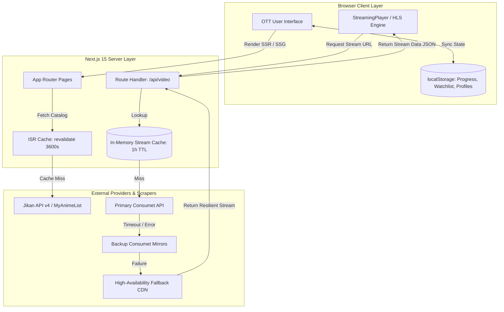
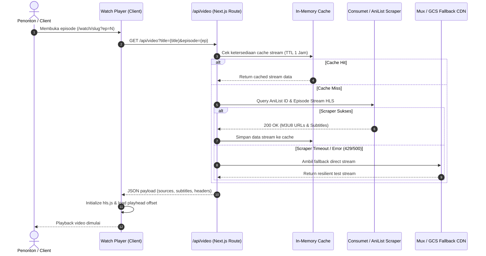

<div align="center">

# YourU Cinema

### Enterprise-Grade Netflix-Style Anime Streaming Web Platform

[](https://nextjs.org/)
[](https://react.dev/)
[](https://www.typescriptlang.org/)
[](https://tailwindcss.com/)
[](https://github.com/video-dev/hls.js/)
[](https://www.docker.com/)
[](LICENSE)

<p align="center">
  A modern, high-performance Over-The-Top (OTT) streaming web application engineered with Next.js 15 App Router, React 19, and Tailwind CSS v4. Designed with Netflix-inspired cinematic aesthetics, dynamic HLS stream resolution with multi-endpoint failover, client-side state persistence, and standalone Docker deployment.
</p>

[Key Features](#key-features) • [System Architecture](#system-architecture) • [Getting Started](#getting-started) • [Deployment](#docker--production-deployment) • [Roadmap](#roadmap)

</div>

---

## Overview

**YourU Cinema** delivers a fluid streaming experience without invasive advertising. The platform integrates real-time metadata indexing via MyAnimeList / Jikan API and automated stream parsing via Consumet / AniList resolvers, backed by in-memory caching and graceful fallback video delivery.

### Key Highlights
- **Cinematic OTT UI/UX**: Built on dark glassmorphic design (`#141414`), responsive hero banners with triple-gradient alpha masking, interactive 250ms delayed hover cards with action triggers, and Top 10 numbered leaderboards.
- **Adaptive Video Engine**: Powered by `hls.js` with quality switching, audio track & softsub selector modal, theater mode dimmer overlay, pause-idle synopsis card, and 5-second automatic episode advancement.
- **Dual-Layer Architecture**: Decoupled metadata cataloging (Jikan API v4 with Next.js ISR) and stream link resolution (`/api/video` route handler with failover chain).
- **Zero-Friction Client State**: Localized watch progress tracking (5% to 90% auto-detection for "Continue Watching"), watchlist ("My List"), custom profile switcher, and custom episode CMS.
- **Container-Native**: Multi-stage standalone Docker build minimizing final image footprint for rapid deployment to Kubernetes, AWS ECS, or bare-metal VPS.

---

## System Architecture

The following diagram illustrates the interaction between presentation components, state storage, proxy route handlers, and external upstream providers:



---

## Video Resolution Sequence

When a user initiates playback, the application executes a resilient fallback strategy to guarantee continuous uptime:



---

## Technical Specifications & Details

<details>
<summary><b>1. Installation & Local Development</b></summary>

### Prerequisites
- Node.js `20.x` or `22.x`
- npm, pnpm, or yarn
- Git

### Setup Steps
1. Clone the repository:
   ```bash
   git clone https://github.com/AlphaIsYour/youru-cinema.git
   cd youru-cinema
   ```

2. Install dependencies:
   ```bash
   npm install
   ```

3. Configure environment variables:
   ```bash
   cp .env.example .env.local
   ```

4. Launch the local development server:
   ```bash
   npm run dev
   ```

5. Access the application at `http://localhost:3000`.

</details>

<details>
<summary><b>2. Environment Variables Reference</b></summary>

| Variable | Required | Default Value | Description |
| :--- | :---: | :--- | :--- |
| `NEXT_PUBLIC_CONSUMET_API` | Optional | `http://localhost:3001` | Public endpoint for Consumet API instance. Falls back to public mirrors if not set. |
| `PORT` | Optional | `3000` | Port on which the Next.js standalone server listens inside container. |
| `NODE_ENV` | Optional | `development` | Target runtime environment (`development` / `production`). |

</details>

<details>
<summary><b>3. Directory Structure & Key Modules</b></summary>

```
youru-cinema/
├── app/
│   ├── admin/                  # Custom video source CMS & mock metrics
│   ├── anime/                  # Catalog detail routes ([slug])
│   ├── api/
│   │   └── video/route.ts      # Backend stream scraper proxy & caching layer
│   ├── components/             # Reusable UI & Player components
│   │   ├── AnimeCard.tsx       # Netflix hover preview popover card
│   │   ├── AnimeCarousel.tsx   # Horizontal scrollable category row
│   │   ├── DetailModal.tsx     # Fullscreen expandable anime detail dialog
│   │   ├── Navbar.tsx          # Dynamic responsive header & search bar
│   │   ├── StreamingPlayer.tsx # Custom hls.js video player with controls
│   │   ├── Top10Carousel.tsx   # Numbered leaderboard carousel
│   │   └── WatchPlayer.tsx     # Player container with progress tracking
│   ├── lib/
│   │   ├── animeMapping.ts     # Title slugification & mapping helpers
│   │   ├── api.ts              # Jikan v4 API client & fallback data
│   │   ├── favorites.ts        # My List storage manager
│   │   ├── videoProviders.ts   # Multi-endpoint scraper resolution
│   │   ├── videoSources.ts     # Admin custom sources storage
│   │   └── watchHistory.ts     # Watch progress & resume logic
│   ├── movies/                 # Filterable anime movie catalog
│   ├── profiles/               # Multi-user profile picker
│   ├── search/                 # Instant catalog search with genre pills
│   ├── watch/                  # Core video player routes ([slug])
│   ├── globals.css             # Tailwind v4 styles & custom scrollbars
│   ├── layout.tsx              # Root HTML layout & font definitions
│   └── page.tsx                # Netflix-style homepage with thematic rows
├── scripts/
│   └── test-video-providers.js # Diagnostic CLI test script for video providers
├── Dockerfile                  # Multi-stage production build (standalone)
├── docker-compose.yml          # Container orchestration file
├── next.config.ts              # Next.js build & remote image configuration
└── package.json                # Project dependencies and script declarations
```

</details>

<details>
<summary><b>4. Video Player State Machine & Fallback Lifecycle</b></summary>

1. **Mounting Phase**: Reads saved playhead offset from `localStorage` (`watch-progress-[slug]-[ep]`).
2. **Resolution Phase**: Dispatches request to `/api/video?title=...&episode=...`.
3. **Stream Initialization**:
   - Evaluates source type (`isM3U8`).
   - If HLS and supported: initializes `hls.js` with `enableWorker: true` and `lowLatencyMode: true`.
   - If direct MP4 or native Safari HLS: attaches stream directly to `<video>` element.
4. **Active Playback**:
   - Debounced progress sync every 5 seconds to `watch_history` (triggers "Continue Watching" upon returning).
   - Dynamic control fade after 3.5 seconds of mouse inactivity.
5. **Idle State (> 3s Pause)**:
   - Renders a semi-transparent cinematic overlay with show title, maturity rating, match score, and synopsis.
6. **Completion**:
   - Triggers 5-second circular countdown timer advancing automatically to Episode `N + 1`.

</details>

<details>
<summary><b>5. Security & Production Deployment Checklist</b></summary>

- [x] **Standalone Next.js Output**: Enabled in `next.config.ts` for lean Docker containers.
- [x] **Non-Root Container Execution**: `Dockerfile` executes as user `nextjs:nodejs` (UID 1001).
- [x] **Secure Image Optimization**: Strict `remotePatterns` enforced for `cdn.myanimelist.net`, `s4.anilist.co`, `img1.ak.crunchyroll.com`, and `i.ytimg.com`.
- [ ] **Rate Limiting**: Implement Redis / Upstash rate limiting on `/api/video` to prevent upstream scraper blacklisting.
- [ ] **Content Security Policy (CSP)**: Establish strict headers allowing media sources from trusted CDN endpoints.
- [ ] **Database Migration**: Migrate `localStorage` user sessions and favorites to PostgreSQL / Supabase with NextAuth.js / Auth.js.

</details>

---

## Docker & Production Deployment

The project includes an optimized multi-stage `Dockerfile` and `docker-compose.yml` configured for zero-downtime deployment.

### Build & Run via Docker Compose
```bash
# Clone and build containers
docker-compose up -d --build

# View real-time container logs
docker logs -f youru-cinema-app

# Gracefully terminate
docker-compose down
```

### Standalone Docker Build
```bash
# Build production image
docker build -t youru-cinema:latest .

# Run container exposing port 3000
docker run -p 3000:3000 --name youru-cinema youru-cinema:latest
```

---

## Roadmap

Planned enterprise additions and feature gap milestones are detailed in [ROADMAP_ISSUES.md](ROADMAP_ISSUES.md).

---

## License

This project is licensed under the [MIT License](LICENSE).
